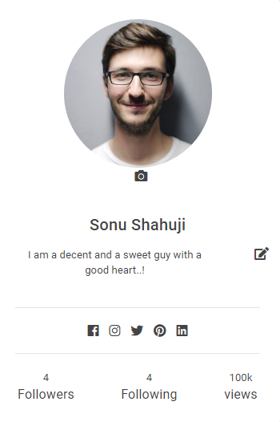

  

<h3 align="center">Social Network</h3>

   
   
  
  
  

---

  Evento is a social media platform where people who wants to participate or wants to be active in attending events or wants to be aware of different events happening around them or get notified for a particular event or interested in promoting events. This is a platform where people can keep track of certain events and have access to various information like upcoming, active, past events, user’s gallery for viewing the event photos, videos, stories, live video streaming and so on and have interaction through post and with friends..
      

## 🏁 Getting Started 
These instructions will get you a copy of the project up and running on your local machine for development 
and testing purposes.

### Installing
- [XAMPP](https://www.apachefriends.org/index.html/) - Install XAMPP
- [NodeJS](https://nodejs.org/en/) - Install NodeJS Version v10.16.0

        -Create a Folder:
            npm init
            npm install
                "body-parser": "^1.19.0",
                "bootstrap": "^4.3.1",
                "bower": "^1.8.8",
                "cors": "^2.8.5",
                "ejs": "^2.6.1",
                "express": "^4.16.4",
                "express-ejs-layouts": "^2.5.0",
                "express-hbs": "^2.1.2",
                "express-mysql-session": "^2.1.0",
                "express-partials": "^0.3.0",
                "express-session": "^1.16.1",
                "express-validator": "^5.3.1",
                "dateformat": "^3.0.3",
                "install": "^0.13.0",
                "joi": "^14.3.1",
                "jquery": "^3.4.0",
                "jquery-browserify": "^1.8.1",
                "jquery-mousewheel": "^3.1.13",
                "local-storage": "^2.0.0",
                "multer": "^1.4.1",
                "mysql2": "^1.6.5",
                "node-datetime": "^2.1.2",
                "owl.carousel": "^2.3.4",
                "passport": "^0.4.0",
                "router": "^1.3.3",
                "sequelize": "^5.11.0",
                "session-file-store": "^1.2.0",
    

- Start XAMPP
- Create a database "events"
- Populate the database with data
    - Open backup_sql_data
        - open events.sql 

- Open Terminal and type...
    - nodemon server.js

## Project Structure 
    => backup_sql_data
    => config
        - db.js
    => model
        - comment_model.js
        - like_model.js
        - login_details_modul.js
        - model_follow.js
        - model_index.js
        - postbody_model.js
        - send_message_model.js
        - user_model.js
    => node_modules
    => public
        => bootstrap
           => css
           => js
        => css
        => image
        => jquery
        => profile_image
    => routes
        => api     
    => views
       => components
       => partials
         => includes
           - footer.ejs
           - header.ejs
           - navbar.ejs
        - editProfile.ejs
        - event_page.ejs
        - findUserProfile.ejs
        - home.ejs
        - login.ejs
        - profile.ejs
        - registeration.esj
        - showActivity.ejs
        - viewprofile.ejs
    app.js
    package-lock.json
    package.json
    README.md
    server.js

## 🧐 Coding Challenge 
Create a small social network

## Fontend/Backend Both

## What are we looking for ? **

# 0. DEMO 
-[EvenTo a Social Network](https://drive.google.com/file/d/1KTsTd1b3otCGb4R34EdpITnGXM-foNH4/view?usp=sharing/) - See Video
    
# 1. How creative is your solution ?
    - Easy communication
    - Event notification
    -
    

# 2. Commit history to see how your work evolved
- [See Commit History](https://github.com/sonushahuji4/Eventos/commits/master/) - Social Network
    
# 3. Code quality and best practices

    ❖ Project Structure

    => backup_sql_data
    
    => config
        - db.js

    => model
        - comment_model.js
        - like_model.js
        - login_details_modul.js
        - model_follow.js
        - model_index.js
        - postbody_model.js
        - send_message_model.js
        - user_model.js

    => node_modules

    => public
        => bootstrap
           => css
           => js
        => css
        => image
        => jquery
        => profile_image

    => routes
        => api
            - chatapi.js
            - edit[Profile.js
            - event_page.js
            - login.js
            - logout.js
            - post_api.js
            - profile_api.js
            - registeration.js
            - showActivity.js
            - viewprofile.js
           
    => sessions
    => views
       => components
          - chat_side_bar.ejs
          - create_posts.ejs
          - display_events_options.ejs
          - find_events.ejs
          - psots.ejs
          - recomment_events_for_users.ejs
          - user_suggestion_box.ejs
          - view_story.ejs
       => partials
         => includes
           - footer.ejs
           - header.ejs
           - navbar.ejs

        - editProfile.ejs
        - event_page.ejs
        - findUserProfile.ejs
        - home.ejs
        - login.ejs
        - profile.ejs
        - registeration.esj
        - showActivity.ejs
        - viewprofile.ejs

    app.js
    package-lock.json
    package.json
    README.md
    server.js

# 4. Documentation

 => System Architecture

        - Internal Flow

   

        - System Flow 

   

# Images:

- User Stories

- User Gallery

- Nav Bar

- Search User

- View User profile

- Create Post

- Post View

- Like Comment

- List of Upcoming Events

- List of Previous Events

- User Activity Dashboard

- Onclick dashboard, get all particular events

- Closer view for events

- User Profile Update

- Update Personal Details

- Chat Application

- Notification for message

- Online - Offline User list

- Search events by

- Search events by location

- Search events by specific dates

- User home profile view

- Follow - Unfollow user 

- Recommend events for users

# Features:

    Registration and Login 
        • User will have to register themselves by providing basic information about them and then they can login into the system. 
        • Once users have logged in, users will be provided with Feeds Section, Profile, Notification page and Maps. 

    Feeds section:   
        • All the posts like images, videos or events related articles will be viewed here.
        • Event stories, Live Video streaming for an event. 
        • Can create own event (snap, images, videos, GIF) with many different artificial effects to look more attractive to audience. 
        • Can also Like, Comment, Follow, Share, Report, Going, Interested In, set a Reminder, buy/sell passes 
        • Theses post will be recoded to user’s dashboard so that other users can snoop through what all events had happened in past and get all related events information like upcoming, Active events, number of people attended the events, their review on events, comments, like and rating and so on through user’s dashboard. 
        • Side bar Recommendation section where all recommended events, groups, people with similar interest will be recommended to users.  
        • This will also involve user interaction with post by doing some action on posts. 
        • Can view snap, images, Videos, Gif of past events and get to know many more details about the events.

    ❖ Profile Section:    
        • Basic information about the user will be accessible if it is not private. 
        • Dashboard with brief information for upcoming events, Active event, Past events, Number of people attending, participating, Followers, reviews and so on. 
        • Store (Gallery) where people can view event photos, snap, videos. 
        • Mission, Vision, Status and Difference. 
        • Can create own event (snap, images, videos, GIF) with many different artificial effects to look more attractive to audience. 

    ❖ Notification: 
        • All the notifications related to user interests will be received here. 
        • Like who wants to buy passes, number of people attending events. 
        • They will be notified if users want to buy passes, going, attending, interested in or wants to work in collaboration. 
        • If people set reminders for any event, they will be notified here.

    ❖ Map: 
        • User can also make a use of map like search for an event on map and map will show all related and nearby events to user by popping up event information with different colours. 

    ❖ Common Features 
        => Search Events by Location:
            User can search/view events based on location like from current location, by area, by state, by country.

        => Follow/Unfollow:
            User can follow or unfollow others user. If user is following a particular user, then that user can see their post/events on FEED SECTION.

        => Search Bar: 
            User can find other people, other colleges, events. 
        
        => Chat: 
            User can chat with each other

# 5. Functionality
    ❖ Registration
    ❖ Login
    ❖ Update your profile picture and personal details anytime
    ❖ Create Event/Post
    ❖ Tools to create events/posts
    ❖ Like,comment
    ❖ Friends/User suggestion
    ❖ Follow or Unfollow
    ❖ Post/Event is seen based on follow or unfollow
    ❖ View Events/Post based on location like current location,by area, by city,by state, by country
    ❖ View Active,Upcoming,Past events details
    ❖ Shows Number of followers and followings
    ❖ Onmouse on post zoom effect
    ❖ Onclcik post, closer view
    ❖ Show number of active,upcoming,past and total events
    ❖ Chat box side bar with online user list
    ❖ Indication of Online/Offline user list
    ❖ Events recommendation based on user activity
    ❖ No need to type address, just keyword the address google map API will fetch the address
    ❖ Event itself contents "MAP" indication which points to the address of the event
    ❖ Last seen of user
    ❖ You can search a particular user
    ❖ Dashboard, which keeps the record of user activities
    ❖ User 

## 🎈 Usage 
 Evento is a social media platform where people who wants to participate or wants to be active in attending events or wants to be aware of different events happening around them or get notified for a particular event or interested in promoting events. This is a platform where people can keep track of certain events and have access to various information like upcoming, active, past events, user’s gallery for viewing the event photos, videos, stories, live video streaming and so on and have interaction through post and with friends. 

## ⛏️ Built With 
- [MySQL](https://https://www.mysql.com/) - Database
- [Sequelize ORM](https://sequelize.org//) - ORM
- [Express](https://expressjs.com/) - Server Framework
- [EJS Tamplate](https://ejs.co/) - Web Framework
- [NodeJs](https://nodejs.org/en/) - Server Environment
- [Google Map API](https://cloud.google.com/) - Library
- [BootStrap 4](https://getbootstrap.com/) - Library
- [Highcharts](https://www.highcharts.com/) - Library
- [AJAX](https://jquery.com/)

## ✍️ Authors 
- [@Sonu Shahuji](https://github.com/sonushahuji4) - Evento a Social Network

## 🎉 Acknowledgments 
- References
- [TownScript](https://www.townscript.com/)
- [Know A Fest](http://www.knowafest.com/)
- [College Fever](https://www.thecollegefever.com/)

 
 
